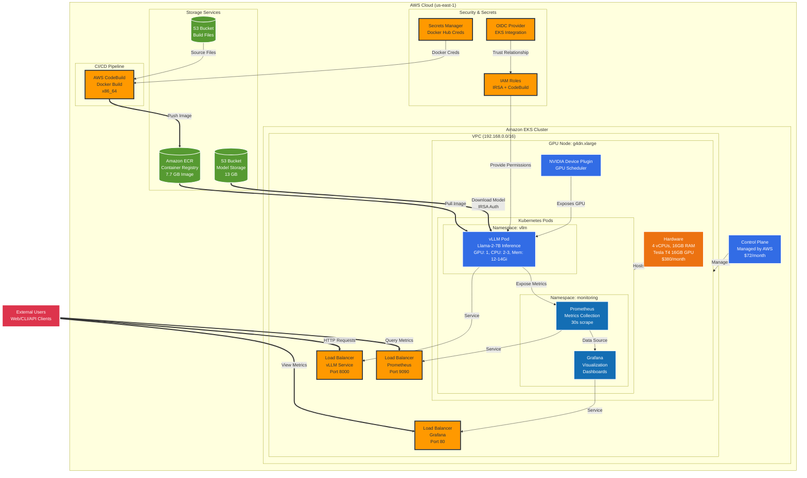

```mermaid
graph TB
    %% Styling
    classDef awsService fill:#FF9900,stroke:#232F3E,stroke-width:3px,color:#232F3E
    classDef k8sService fill:#326CE5,stroke:#fff,stroke-width:2px,color:#fff
    classDef storage fill:#569A31,stroke:#fff,stroke-width:2px,color:#fff
    classDef compute fill:#EC7211,stroke:#fff,stroke-width:2px,color:#fff
    classDef monitoring fill:#146EB4,stroke:#fff,stroke-width:2px,color:#fff
    classDef user fill:#DD344C,stroke:#fff,stroke-width:3px,color:#fff
    
    %% Users
    USER[External Users<br/>Web/CLI/API Clients]:::user
    
    %% AWS Services Layer
    subgraph AWS["AWS Cloud (us-east-1)"]
        direction TB
        
        %% Storage Services
        subgraph STORAGE["Storage Services"]
            S3_MODEL[(S3 Bucket<br/>Model Storage<br/>13 GB)]:::storage
            S3_BUILD[(S3 Bucket<br/>Build Files)]:::storage
            ECR[(Amazon ECR<br/>Container Registry<br/>7.7 GB Image)]:::storage
        end
        
        %% Security Services
        subgraph SECURITY["Security & Secrets"]
            SM[Secrets Manager<br/>Docker Hub Creds]:::awsService
            IAM[IAM Roles<br/>IRSA + CodeBuild]:::awsService
            OIDC[OIDC Provider<br/>EKS Integration]:::awsService
        end
        
        %% Build Pipeline
        subgraph BUILD["CI/CD Pipeline"]
            CB[AWS CodeBuild<br/>Docker Build<br/>x86_64]:::awsService
        end
        
        %% EKS Cluster
        subgraph EKS_CLUSTER["Amazon EKS Cluster"]
            direction TB
            
            CP[Control Plane<br/>Managed by AWS<br/>$72/month]:::k8sService
            
            subgraph VPC["VPC (192.168.0.0/16)"]
                direction TB
                
                subgraph NODE["GPU Node: g4dn.xlarge"]
                    direction TB
                    GPU_HW[Hardware<br/>4 vCPUs, 16GB RAM<br/>Tesla T4 16GB GPU<br/>$380/month]:::compute
                    
                    subgraph K8S_PODS["Kubernetes Pods"]
                        direction LR
                        
                        subgraph NS_VLLM["Namespace: vllm"]
                            VLLM_POD[vLLM Pod<br/>Llama-2-7B Inference<br/>GPU: 1, CPU: 2-3, Mem: 12-14Gi]:::k8sService
                        end
                        
                        subgraph NS_MON["Namespace: monitoring"]
                            PROM[Prometheus<br/>Metrics Collection<br/>30s scrape]:::monitoring
                            GRAF[Grafana<br/>Visualization<br/>Dashboards]:::monitoring
                        end
                    end
                    
                    NVIDIA[NVIDIA Device Plugin<br/>GPU Scheduler]:::k8sService
                end
                
                LB_VLLM[Load Balancer<br/>vLLM Service<br/>Port 8000]:::awsService
                LB_PROM[Load Balancer<br/>Prometheus<br/>Port 9090]:::awsService
                LB_GRAF[Load Balancer<br/>Grafana<br/>Port 80]:::awsService
            end
        end
    end
    
    %% Data Flows
    USER ==>|HTTP Requests| LB_VLLM
    USER ==>|View Metrics| LB_GRAF
    USER ==>|Query Metrics| LB_PROM
    
    S3_BUILD -->|Source Files| CB
    SM -->|Docker Creds| CB
    CB ==>|Push Image| ECR
    
    ECR ==>|Pull Image| VLLM_POD
    S3_MODEL ==>|Download Model<br/>IRSA Auth| VLLM_POD
    IAM -->|Provide Permissions| VLLM_POD
    OIDC -->|Trust Relationship| IAM
    
    CP -->|Manages| NODE
    GPU_HW -->|Hosts| K8S_PODS
    NVIDIA -->|Exposes GPU| VLLM_POD
    
    VLLM_POD -->|Expose Metrics| PROM
    PROM -->|Data Source| GRAF
    
    VLLM_POD -->|Service| LB_VLLM
    PROM -->|Service| LB_PROM
    GRAF -->|Service| LB_GRAF
```
